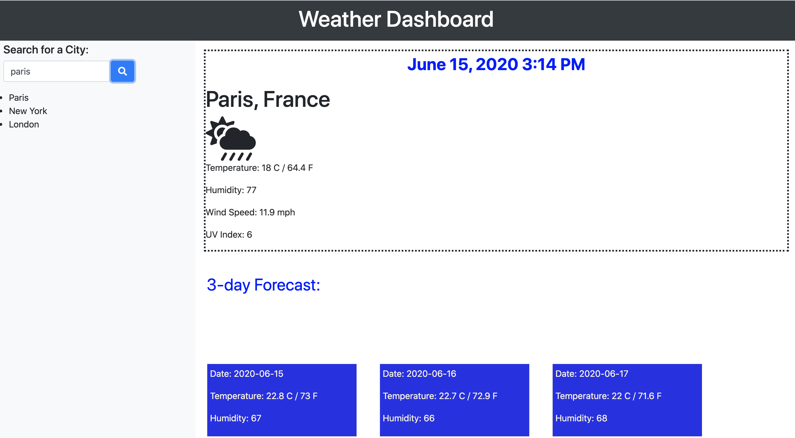

# 06 Server-Side APIs: Weather Dashboard

1. Get API, Set working URL
2. Font icons of weather
3. Retrieve user's input and convert to variables
4. User variables to run AJAX call to Weather website
5. Break down the Weather Object into useable fields
6. Dynamically generate HTML content
7. Dealing with "edge cases" - bugs
8. attach screenshot
9. create list of default cities.
10. google autocompletion for cities.???

